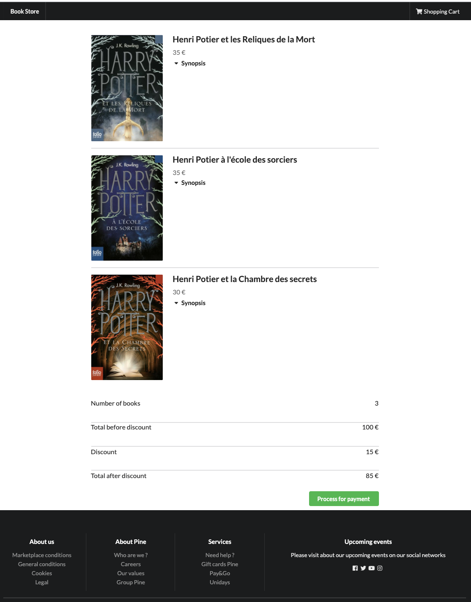

# Semantic-ui-react-henri-potier-store
[](http://hits.dwyl.com/JananyMano/book-store)

This project was bootstrapped with [Create React App](https://github.com/facebookincubator/create-react-app) and used [semantic-ui-react](https://react.semantic-ui.com/). This project is a e-commerce platform with 2 user interfaces.

## User Interface

- [x] 1st user interface : Store : Display the list of Books and allow user to search for a specific one

- [x] 2nd user interface : Payment : Display the shopping cart details and the best discount




## Running

```bash
$ npm install
$ npm start
```

The server should be live at <http://localhost:3000>.

### Requirements
When trying to build Semantic-UI,  I've only had success with `npm@6`,
`node@8`, and `gulp@3` due to version incompatibilities of [Semantic-UI with
`gulp@4`](https://github.com/Semantic-Org/Semantic-UI/issues/6705) and [`>node@8` with `gulp@3`](https://github.com/nodejs/node/issues/19786).
Hopefully these will get fixed upstream, but until then you may have to revert
versions to work with Semantic-UI at all. Here's my working setup:

```
$ node --version
v8.16.0
$ npm --version
6.4.1
$ gulp --version
[12:29:54] CLI version 3.9.1
[12:29:54] Local version 3.9.1
```

The `gulp` version is specified in the `package.json`, but you may need to
setup `npm` and `node` for your system.

### Packages required
- [x] Axios
- [x] React-Redux
- [x] React-Thunk
- [x] React-Router-Dom
- [x] Redux
- [x] Redux-Thunk
- [x] lodash
- [x] semantic-ui-react

### Issues faced

```
ReferenceError: primordials is not defined in node
```

Use following commands to install node v11.15.0 and gulp v3.9.1:
```
npm install -g n
sudo n 11.15.0
npm install gulp@^3.9.1
npm install 
npm rebuild node-sass
```


